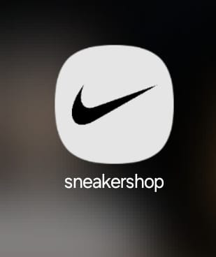

# Sneaker Shop - Nike

Welcome to the Sneaker Shop app, focusing on Nike products!

## Introduction

This Flutter project serves as a mobile application for browsing and shopping Nike sneakers. It includes features such as a home page displaying products, a cart for managing selected items, and a drawer for navigation options.

## Screenshots

### Home Page

### Icon

### Drawer

### Main Page

### Cart Success Page

## Getting Started

To get started with Flutter development:

1. Install Flutter by following the [installation guide](https://flutter.dev/docs/get-started/install).
2. Clone this repository.
3. Open the project in your preferred editor.
4. Run `flutter pub get` to install dependencies.
5. Connect a device or start an emulator.
6. Run `flutter run` to launch the application.

## Features

- **Home Page**: Displays Nike sneakers and allows browsing.
- **Cart**: Manages selected items for checkout.
- **Drawer Navigation**: Provides quick access to different sections of the app.

## Acknowledgments

- Flutter documentation and community for valuable resources.
- Icons used from [Material Icons](https://fonts.google.com/icons).
- Nike logo image sourced from [Nike](https://www.nike.com).

